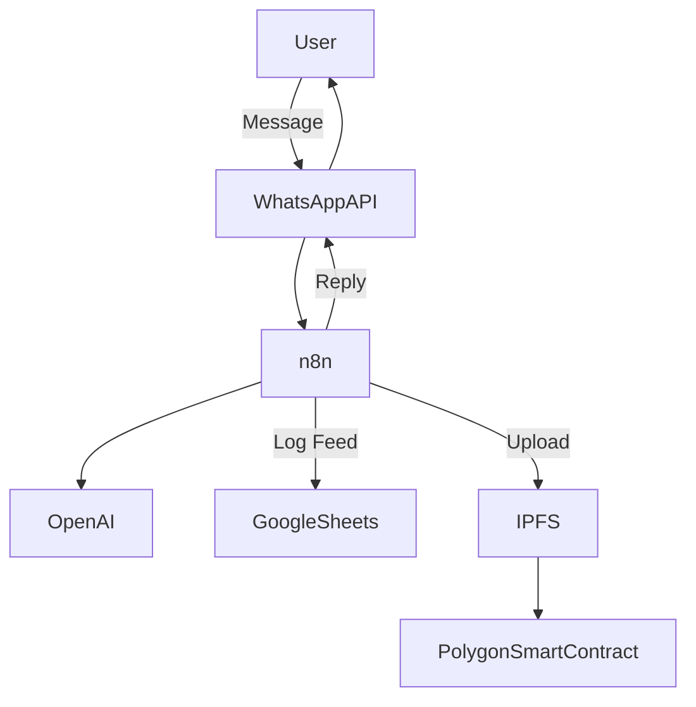

# 🍼 Mamo: AI + Blockchain Breastfeeding Companion

> A WhatsApp-based AI assistant that empowers new mothers with real-time breastfeeding guidance, feeding logs, and secure health data ownership — built with n8n, OpenAI, and IPFS.

---

## 🧠 Problem

New mothers often struggle with breastfeeding questions, baby feeding patterns, and overwhelming health advice — all without consistent access to lactation experts or secure ways to record this data. Most importantly, they don’t truly **own** their personal maternal health logs.

---

## 💡 Solution

**Mamo** is a smart, secure assistant that:
- 🧑‍⚕️ Provides **instant, personalized AI answers** to breastfeeding and baby care questions
- ⏱️ Lets moms **log feeding sessions and notes** via simple WhatsApp messages
- 🔐 **Secures logs on IPFS** and stores references on **Polygon blockchain** for verifiability and ownership

---

## ⚙️ How It Works

### 📲 1. User Interaction (via WhatsApp)
- "How do I know if my baby is getting enough milk?"
- "Log 15 mins left breast at 10:30 AM"

### 🔁 2. n8n Workflow Automation
- Receives messages via WhatsApp API webhook
- Parses intent (Q&A or log entry)
- Uses OpenAI GPT to generate advice
- Sends feeding logs to IPFS (via Pinata)
- Saves IPFS hash and timestamp on Polygon blockchain
- Returns response to user via WhatsApp

---

## 🛠️ Tech Stack

| Feature                  | Tool/Platform              |
|--------------------------|----------------------------|
| AI Chat                  | OpenAI GPT-4               |
| Messaging Interface      | WhatsApp API (360dialog)   |
| Workflow Automation      | n8n.io                     |
| Structured Logging       | Google Sheets / MongoDB    |
| Decentralized Storage    | IPFS (Pinata API)          |
| Blockchain Ledger        | Polygon (testnet)          |
| Optional Dashboard       | Streamlit (WIP)            |

---

## 🔐 Why Blockchain?

Breastfeeding logs and maternal health data are sensitive. Using IPFS + blockchain gives:
- ✅ **Tamper-proof recordkeeping**
- ✅ **Data privacy & ownership**
- ✅ **Selective sharing** with healthcare providers

---

## 🎯 Key Features

- ✅ AI-powered WhatsApp lactation assistant
- ✅ Logs feeding duration, time, and side
- ✅ IPFS + Polygon-backed secure diary
- ✅ Accessible to moms in any region via WhatsApp
- ✅ Built solo in <3 weeks with zero-code tools + AI

---

## 📸 Screenshots & Demo

*(Coming soon)*

- 📱 WhatsApp chat interaction
- 🔁 n8n flow editor
- 📦 IPFS log response
- 🌐 Blockchain transaction explorer

---

## 🧱 Architecture Diagram

*(Placeholder for mermaid/PNG flow)*

---
## 🙌 Why This Matters
Mamo is built to support mothers — especially those in under-resourced areas — with trusted guidance and ownership of their data, using modern AI + Web3 tools.
---
## 🧪 Built For
- 🧬 Colostrum Hackathon 2025
- 🧑‍🎓 Solo builder
- ⌛ Timeframe: <3 weeks
- ❤️ Inspired by real challenges faced by mothers postpartum
---
## 📜 License
- MIT
---
## ✨ Coming Soon
- 🔤 Multilingual support (Hindi, Spanish)

- 🧠 Mood + mental health detection

- 📊 Web dashboard with feeding patterns
